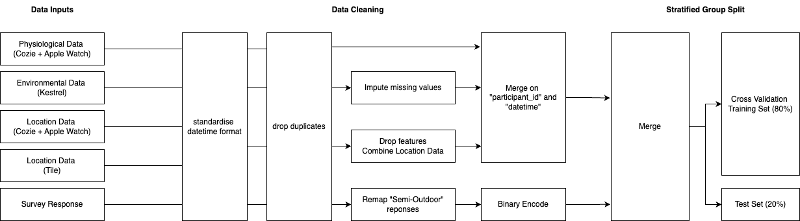
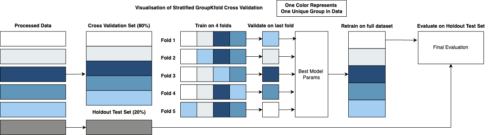
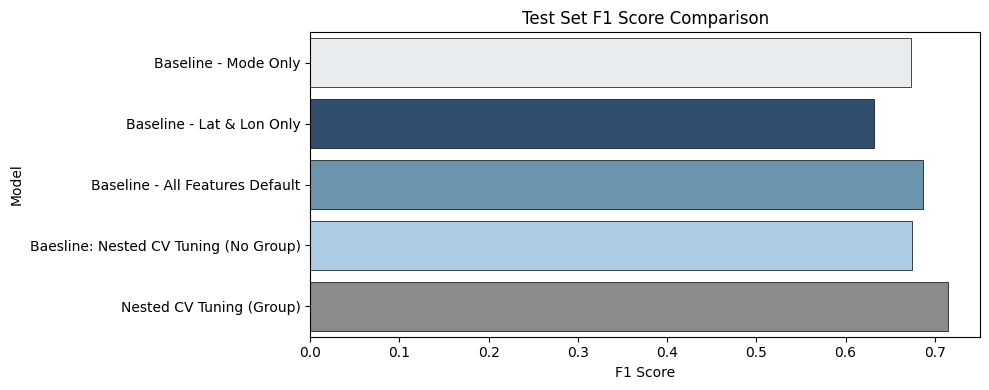
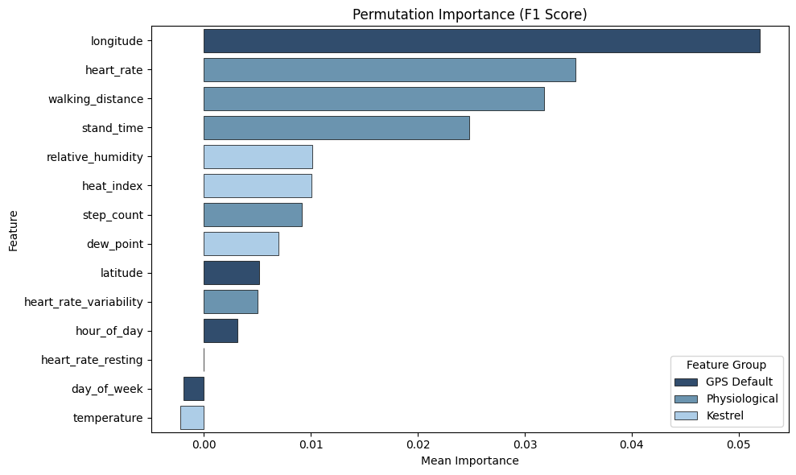

# A Multi-Modal Wearable and Machine Learning Framework for Accurate Indoor-Outdoor Classification in Urban Climate Studies

This repository contains the code and supporting files for the paper:

> **A Multi-Modal Wearable and Machine Learning Framework for Accurate Indoor-Outdoor Classification in Urban Climate Studies**  
> **Authors**: Chan Jun Hao, Jean You, Rudi Stouffs, Ben Gottfried Gottkehaskamp, and Clayton Miller.

## Overview
This repository contains the code and methodology developed for classifying indoor versus outdoor environments by fusing wearable sensor data with subjective self-reports. The framework is designed specifically for climate researchers and public health practitioners studying heat exposure patterns, particularly for vulnerable populations like older adults.

## Features

- Multi-modal data integration from wearable sensors (physiological and environmental)
- Support for real-time subjective feedback data collection
- Robust preprocessing pipeline for messy real-world data
- Group-aware cross-validation to ensure model generalizability
- Interpretable machine learning model based on CatBoost algorithm
- User-friendly implementation accessible to non-technical users

## Introduction

Urban populations are facing intensifying heat stress, exacerbated in dense cities by the Urban Heat Island (UHI) effect. Older adults are particularly vulnerable due to their diminished capacity to regulate body heat. This project provides a framework for distinguishing indoor vs. outdoor environments using:

- **Physiological Wearable Data** (Heart rate, step count, etc.)
- **Environmental Measurements** (Temperature, humidity, heat index)
- **Location Data** (GPS tracking)
- **Subjective Self-reports** (Micro-surveys)

The goal is to enable accurate, participant-centric classification of indoor vs. outdoor environments, which is a crucial prerequisite to understanding personal heat exposure patterns.

## 📥 Download the App
Step by step video tutorial: [Watch on YouTube](https://www.youtube.com/watch?v=vcyOgcfBTiU)

To download and run the classifier app, go to the latest release:
➡️ [Latest Release](https://github.com/chanjunha0/SBE2025-wearable-io-classification/releases/latest)

After downloading `classifier.app.zip`, unzip it and double-click `classifier.app` to launch.
>**No Additional Downloads**: does not require the user to download anything extra beyond the application. 

>**Data Privacy is maintained**:  all training is done locally on the user's machine and is never uploaded.

1. Download the classifier.exe and mock data.
2. Run classifier.exe
3. Input the parameters and upload the data
4. Click "Process file"
5. Predicted results saved and returned as a csv.

The mock data was generated using https://www.mockaroo.com/.

## Methodology Overview

This diagram summarizes the data collection, processing, and modeling pipeline:




## Data Collection

In our study, 22 older adult participants from Singapore’s Queenstown district wore:
1. **Apple Watches running the Cozie app** for physiological data and micro-surveys.
2. **Kestrel sensors** for environmental metrics (temperature, humidity, heat index).
3. **Tile trackers** for location logging (GPS coordinates, timestamp).

Participants contributed over 100K timestamped records, including:
- Physiological data (heart rate, steps, stand time)
- Self-reported surveys (location context, comfort)
- Environmental metrics (air temperature, humidity, heat index)
- GPS location logs (latitude, longitude, timestamps)

---

## Data Preprocessing & Cleaning

1. **Timestamp Standardization**  
   - All raw sensor data is converted into a unified datetime format.
   - Duplicate records with identical (datetime, participant_id) are removed or aggregated (e.g., mean heart rate).

2. **Merge and Sync**  
   - Merged Tile and Cozie location data on (datetime, participant_id).  
   - Combined with Kestrel environmental data by matching timestamps.

3. **Imputation and Labeling**  
   - Missing values for Kestrel data (e.g., temperature, humidity) are imputed using mean values.
   - Labels from micro-surveys were mapped to `Indoor = 0` and `Outdoor = 1`.  
   - “Semi-outdoor” labels were either recoded based on participant context or dropped if ambiguous.

4. **Participant-Aware Splitting**  
   - To avoid leakage from the same participant’s data in both training and test sets, we use **GroupShuffleSplit** and **Stratified GroupKFold**.

---

## Model Training & Evaluation



We employ the **CatBoost** (Gradient Boosting) algorithm for classification:

1. **Why CatBoost?**  
   - Handles categorical features with minimal preprocessing.  
   - Robust and often outperforms other tree-based models with default settings.

2. **Cross-Validation**  
   - **Stratified GroupKFold** ensures participant data does not appear across multiple folds.  
   - Hyperparameters tuned via Grid Search over learning rate, tree depth, and number of iterations.

3. **Metrics**  
   - **F1 Score** (primary): Balances **precision** (avoiding false positives) and **recall** (avoiding false negatives).  
   - **Precision** & **Recall**: Complementary metrics for binary classification.

## Model Performance Comparison

This chart compares the **F1 score, Precision, and Recall** across different modeling strategies, including baselines and the final model:



- Final CatBoost model achieved **F1 = 0.72** on hold-out data, surpassing baselines. 

## Feature Importance Plot

This plot shows the **Permutation Importance** of the top features in the final CatBoost model:



- Permutation Importance shows ``heart_rate``, ``walking_distance``, and ``stand_time`` among the top features.

## Acknowledgements

This research was conducted at the Singapore-ETH Centre, established collaboratively between ETH Zürich and the National Research Foundation Singapore. It is supported by the National Research Foundation, Prime Minister’s Office, Singapore, under its Campus for Research Excellence and Technological Enterprise (CREATE) program.

## Citation

If you use this repository or the methods described in your research, please cite:

```bibtex
@misc{chan2025wearableIO,
  title     = {A Multi-Modal Wearable and Machine Learning Framework for Accurate Indoor-Outdoor Classification in Urban Climate Studies},
  author    = {Chan, Jun Hao and You, Jean and Stouffs, Rudi and Gottkehaskamp, Ben Gottfried and Miller, Clayton},
  year      = {2025},
  howpublished = {\url{https://github.com/chanjunha0/SBE2025-wearable-io-classification}},
}
```

## License
This repository is made available under the MIT License. 